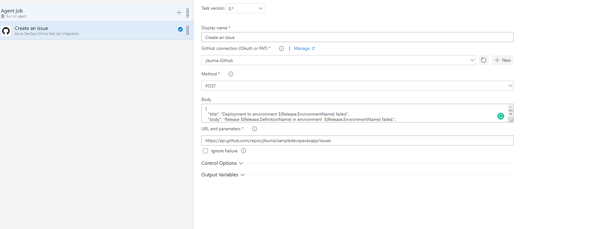
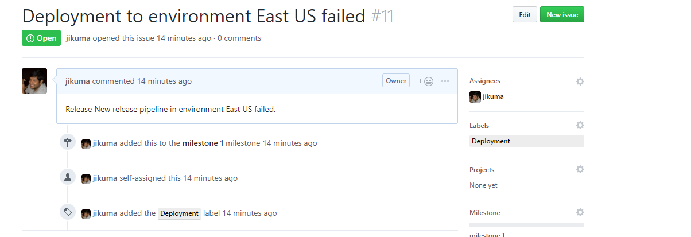

# Create an issue in case of deployment failed

If you want to create an issue if the deployment fialed you need to provide the following inputs

|              Inputs              |      Values                  |
|----------------------------------|------------------------------|
| GitHub connection (OAuth or PAT) | Select a Github endpoint     |
| Method                           | Select Post                  |
| Body                             |  {   "title": "Deployment to environment $(Release.EnvironmentName) failed",   "body": "Release $(Release.DefinitionName) in environment  $(Release.EnvironmentName) failed.",   "assignees": [     "jikuma"   ],   "milestone": 1,   "labels": [     "Deployment"   ] } |
|URL and parameters| https://api.github.com/repos/<Repo Name>/issues e.g: https://api.github.com/repos/jikuma/sampledevspacesapp/issues|

If you do not have milestone number, do not specify in Body json

